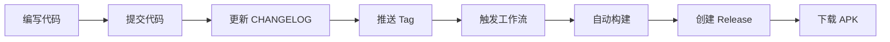

# 🚀 构建工作流快速参考

## 一键发布新版本

```bash
git tag v1.0.0 && git push origin v1.0.0
```

---

## 🔑 必需的 Secrets

| Secret 名称 | 说明 | 示例 |
|------------|------|------|
| `ANDROID_KEYSTORE_BASE64` | Base64 编码的签名密钥 | `MIIKXAIBAz...` |
| `ANDROID_STORE_PASSWORD` | 密钥库密码 | `your_password` |
| `ANDROID_KEY_PASSWORD` | 密钥密码 | `your_password` |
| `ANDROID_KEY_ALIAS` | 密钥别名 | `aigun` |
| `API_URL_PROD` | 生产环境 API | `https://api.aigun.com` |
| `WS_URL_PROD` | 生产环境 WebSocket | `wss://ws.aigun.com` |
| `SENTRY_DSN` | Sentry 错误监控 | `https://xxx@xxx.ingest.sentry.io/xxx` |

---

## 📝 CHANGELOG 模板

在发布前，更新 `CHANGELOG.md`：

```markdown
## [1.0.0] - 2025-10-11

### 新增 ✨
- 添加用户注册和登录功能
- 支持多币种交易（BTC、ETH、SOL）
- 新增交易历史记录

### 修复 🐛
- 修复登录超时问题
- 修复余额显示不准确
- 修复交易确认页面崩溃

### 改进 🚀
- 优化交易执行速度
- 改进 UI/UX 设计
- 提升应用启动速度 30%

### 变更 💥
- 更改 API 基础 URL
- 调整最低支持版本到 Android 5.0

### 安全 🔒
- 加强密码加密算法
- 添加双因素认证支持
```

---

## 🔄 工作流程



---

## 📱 APK 命名规则

```
aigun-v{版本号}-{构建号}.apk
```

**示例：**
- `aigun-v1.0.0-123.apk`
- `aigun-v1.2.3-125.apk`

---

## 🚀 发布说明

所有构建均为生产环境，使用 `API_URL_PROD` 配置。

---

## ⚡ 常用命令

### 查看所有 tag
```bash
git tag -l
```

### 删除本地 tag
```bash
git tag -d v1.0.0
```

### 删除远程 tag
```bash
git push origin :refs/tags/v1.0.0
```

### 查看 tag 详情
```bash
git show v1.0.0
```

### 创建带说明的 tag
```bash
git tag -a v1.0.0 -m "Release version 1.0.0"
```

### 推送所有 tag
```bash
git push origin --tags
```

---

## 🔍 故障排查

### 构建失败
1. 检查 GitHub Actions 日志
2. 确认 Secrets 已正确配置
3. 验证代码无语法错误
4. 检查 CHANGELOG.md 格式

### Tag 无法推送
```bash
# 强制推送（谨慎使用）
git push origin v1.0.0 --force
```

### APK 签名失败
- 检查 `ANDROID_KEYSTORE_BASE64` 是否正确
- 确认密码和别名匹配
- 验证 keystore 文件未损坏

---

## 📊 构建时间参考

| 步骤 | 预计时间 |
|------|---------|
| 环境设置 | 1-2 分钟 |
| 依赖安装 | 2-3 分钟 |
| 代码生成 | 2-4 分钟 |
| APK 构建 | 5-8 分钟 |
| 上传发布 | 1-2 分钟 |
| **总计** | **10-15 分钟** |

---

## 🎯 最佳实践

1. **版本号管理**
   - 遵循语义化版本 (Semver)
   - Major.Minor.Patch 格式
   - 例如：1.0.0 → 1.0.1 → 1.1.0 → 2.0.0

2. **Tag 命名**
   - 格式：`v{主版本}.{次版本}.{修订号}`
   - 示例：`v1.0.0`、`v1.2.3`、`v2.0.0`

3. **发布流程**
   - 在 `dev` 分支开发和测试
   - 合并到 `master` 分支
   - 打 tag 触发自动构建和发布

4. **Changelog 维护**
   - 每次发布前更新 CHANGELOG.md
   - 分类清晰（新增/修复/改进）
   - 简洁明了，用户友好

---

## 📞 快速链接

- [详细使用说明](./使用说明.md)
- [Secrets 配置指南](../SECRETS_SETUP.md)
- [技术文档](./README.md)
- [项目指南](../../CLAUDE.md)

---

**提示：** 将此页面加入书签，方便快速查阅！
